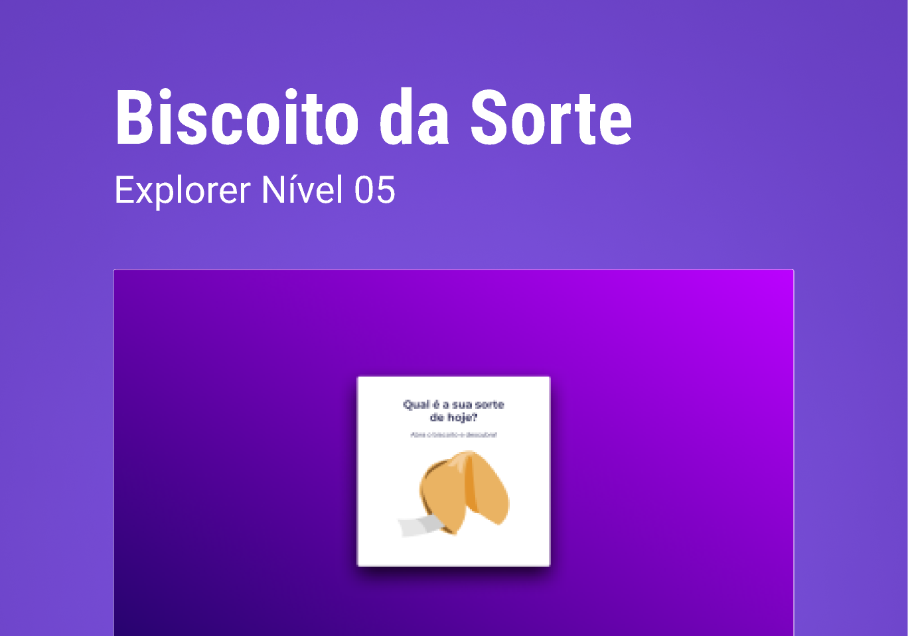

# 🥠 Desafio Biscoito da Sorte - Explorer

Neste desafio o objetivo era criar um jogo chamado Biscoito da Sorte, no qual o usuário, a partir de um clique ou enter, abre um biscoito com a sua sorte do dia. 

Foi um desafio bastante interessante que aprimorou alguns conceitos estudados em aulas.

## 👨‍💻 Tecnologias Utilizadas
 - 🔴 HTML 
 - 🔵 CSS
 - 🟡 JavaScript

 ## 😉 Confira!

 Acesse o link desse projeto incrível clicando aqui 👉 [link](https://antoniofmbr.github.io/desafio_biscoito_da_sorte) e descubra a sua sorte do dia. # desafio_biscoito_da_sorte
